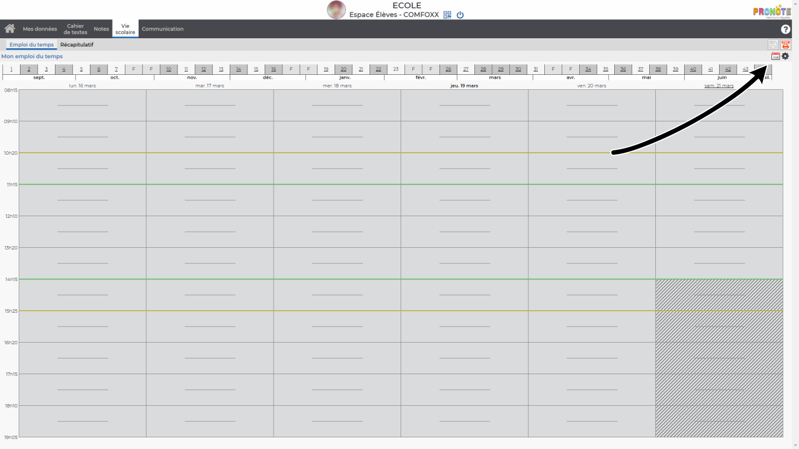
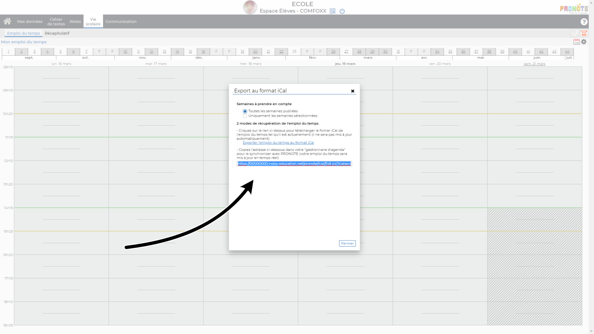
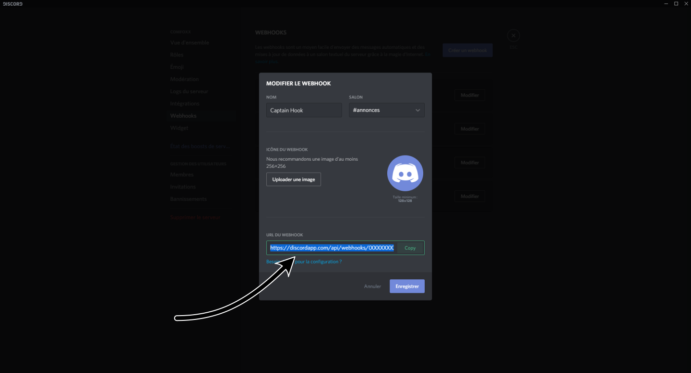

# TongDongBot 🔔

**Pronote iCalendar => Discord Webhooks**

## config.json
```json
{
	"webhookUrl": "https://discordapp.com/api/webhooks/000000000000000000/000000000000000000-0000000000000000000000000000000000000000000000000",
	"pronoteCalendarUrl": "https://00000000.index-education.net/pronote/ical/Edt.ics?icalsecurise=000000000000000000000000000000000000000000000000000000000000000000000000000000000000000000000000&version=2019.0.2.9&param=00000000",
	"delay": 60,
	"name": "Pronote",
	"avatarUrl": "https://cdn.discordapp.com/attachments/000000000000000000/000000000000000000/avatar.png",
	"color": "#10795d"
}
```

`webhookUrl`: webhook url

`pronoteCalendarUrl`: pronote icalendar url

`delay`: delay in seconds (> 1)

`name`: name of the bot

`avatarUrl`: avatar url of the bot

`color`: color of the embed

## Pronote iCal



## Discord Webhook

